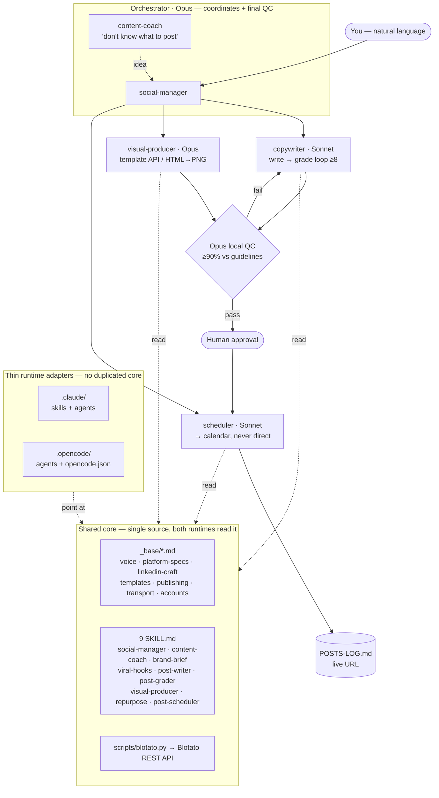

# Blotato Multi-Agent Kit

A **multi-agent social-media system** built on top of [Blotato](https://blotato.com)'s official
content pack. An **orchestrator** directs specialized **subagents** — copywriter, visual-producer,
scheduler — through a **write → grade → visual → schedule** pipeline, with **human approval before
anything is scheduled**. It runs **identically in Claude Code and in opencode** over one shared
core, and it is **brand-agnostic**: clone it, fill in one brand, and go.

> Built by a Blotato user. This kit extends the free 7-skill pack with multi-agent orchestration,
> a REST transport, and an added visuals skill. Credit to Blotato's pack — see
> [Credit](#credit) and [`ANALYSIS.md`](ANALYSIS.md).
>
> **A note on language:** the README and `ANALYSIS.md` are in English. The internal orchestration
> guides (`CLAUDE.md`, the `SKILL.md` files, `_base/`) are in Spanish — the author's working
> language — and are model-facing, not user-facing. Generated **post copy** comes out in whatever
> language you set in `brand-brief.md`.

---

## 1. What it is

- **An orchestrator** (`social-manager`) is the single front door. You talk to it in natural
  language ("post something about X", "put this on LinkedIn and Instagram"). It asks one question
  at a time until it's ~95% sure, then runs the pipeline.
- **Subagents** do the isolable work: a **copywriter** writes+self-grades the copy, a
  **visual-producer** makes the media, a **scheduler** puts it on the calendar.
- **Blotato does; the orchestrator directs.** Blotato writes the copy (via `blotato.py write`),
  renders visuals (template API), extracts sources, and holds the calendar. The orchestrator
  routes, briefs, runs QC, and decides. It never free-writes copy by hand.
- **Two runtimes, one core.** The same `_base/`, `scripts/`, and 9 `SKILL.md` files drive both
  Claude Code (`.claude/`) and opencode (`.opencode/`).

## 2. What it's for

- **Native per-platform copy** — a topic comes out shaped for LinkedIn vs X vs Instagram, in your
  brand's voice, opened with a tested hook (the hook is graded as 50% of the score).
- **Visuals via the template API** — carousels, images, infographics, AI video, or a branded
  HTML→PNG carousel generator when the stock template isn't good enough.
- **Nothing publishes directly** — every piece goes to the Blotato **calendar** (`useNextFreeSlot`
  or a set time). The `post` command refuses to run without a scheduling flag.
- **Quality control by the orchestrator** — it verifies each returned piece against the repo's
  guidelines (voice, platform rules, hook, score) before it ever reaches you for approval.

## 3. Architecture



**Model routing (token efficiency).** Opus orchestrates and does the **final** quality gate;
**Sonnet** does judgment work (copy, grading, voice QC); **Haiku** does mechanical/deterministic
work (script I/O, polling, log rows, asset copying). Cheap-by-default, escalate only when the
cheap model fails QC. In opencode the per-agent model is inherited from `opencode.json`; in Claude
Code it's set per subagent.

## 4. How to use it

**Setup**
```bash
cp scripts/.env.example scripts/.env      # then paste your Blotato API key
# BLOTATO_API_KEY=blt_...  (from my.blotato.com → Settings → API)
python3 scripts/blotato.py whoami         # validates the key
```
Fill in your brand: `brand-brief.md` (voice/audience/wedge), `branding.md` (palette/font/logo),
and `_base/accounts.md` (run `python3 scripts/blotato.py accounts` to get your real account IDs).

**Run it in Claude Code**
- Open the repo in Claude Code. `CLAUDE.md` loads automatically; the 9 skills live in
  `.claude/skills/`, the 3 subagents in `.claude/agents/`.
- Say: *"Post something about &lt;topic&gt; on LinkedIn."* `social-manager` takes it from there.

**Run it in opencode**
- opencode discovers the **same** skills natively from `.claude/skills/` (verify with
  `opencode debug skill`) and reads the 3 adapters in `.opencode/agents/`.
- `opencode.json` sets `"instructions": ["CLAUDE.md"]` and pulls the Blotato key from the
  environment via `{env:BLOTATO_API_KEY}`. opencode does **not** auto-load `.env`, so export it
  first (the Python side reads `scripts/.env` on its own):
  ```bash
  set -a; source scripts/.env; set +a
  opencode
  ```

**The pipeline, step by step**
1. **post-writer** (copywriter) — picks a hook pattern (`viral-hooks`), briefs Blotato, which
   writes the copy; **post-grader** scores it (hook = 50%) and loops to ≥8, regenerating via
   Blotato with corrected instructions. Never hand-edited.
2. **visual-producer** — picks a template, injects your branding, renders via Blotato (or the
   HTML→PNG carousel generator), saves the bytes into `posts/assets/`.
3. **Orchestrator QC** — Opus checks the piece against `_base/` + your brand files; loops until
   ≥90% agreement, then hands it to you.
4. **Human approval** → **post-scheduler** schedules it to the calendar and logs the row (with the
   live URL backfilled) in `POSTS-LOG.md`.

## 5. What we changed vs. the official pack

| Area | Official pack | This kit |
|---|---|---|
| Transport | MCP-only | **Direct REST** (`scripts/blotato.py`); MCP optional fallback |
| Agents | Single-assistant skills | **Multi-agent orchestration** + explicit **model routing** (Opus/Sonnet/Haiku) |
| Visuals | No visuals skill | **`visual-producer`** — visuals via the template API + branded HTML→PNG carousels |
| Runtime | Claude-only | **Portable** — same core runs in Claude Code **and** opencode via thin adapters |

Details and product feedback in [`ANALYSIS.md`](ANALYSIS.md).

## 6. Credit

Built on **Blotato's official content pack** (the 7-skill base: content-coach, brand-brief,
viral-hooks, post-writer, post-grader, repurpose, post-scheduler). Blotato does the heavy lifting —
copy generation, visuals, source extraction, and the calendar — through its API.
→ **[blotato.com](https://blotato.com)**

---

### Repo layout

```
├── CLAUDE.md / AGENTS.md      # orchestration guide (single source) + pointer
├── README.md / ANALYSIS.md    # this + the deeper writeup
├── opencode.json              # opencode config — key via {env:BLOTATO_API_KEY}
├── _base/                     # shared core: voice, specs, publishing, transport, accounts(template)…
├── scripts/                   # blotato.py (REST), .env.example, carousel HTML→PNG generator
├── brand-brief.md             # ← fill in: your brand voice/audience/wedge (template)
├── branding.md                # ← fill in: palette/font/logo (template)
├── POSTS-LOG.md               # append-only log of everything scheduled
├── posts/  examples/          # generated drafts + assets; human-approved exemplars
├── .claude/{skills,agents}/   # Claude Code adapter — the 9 SKILL.md live here (single copy)
└── .opencode/agents/          # opencode adapter (reads the same skills natively)
```

No secrets are committed. `scripts/.env` is gitignored; `opencode.json` never contains a literal
key. Both runtimes read the **one** in-repo copy of the core — editing a `_base/*.md` or a
`SKILL.md` changes behavior everywhere, no second file to touch.
