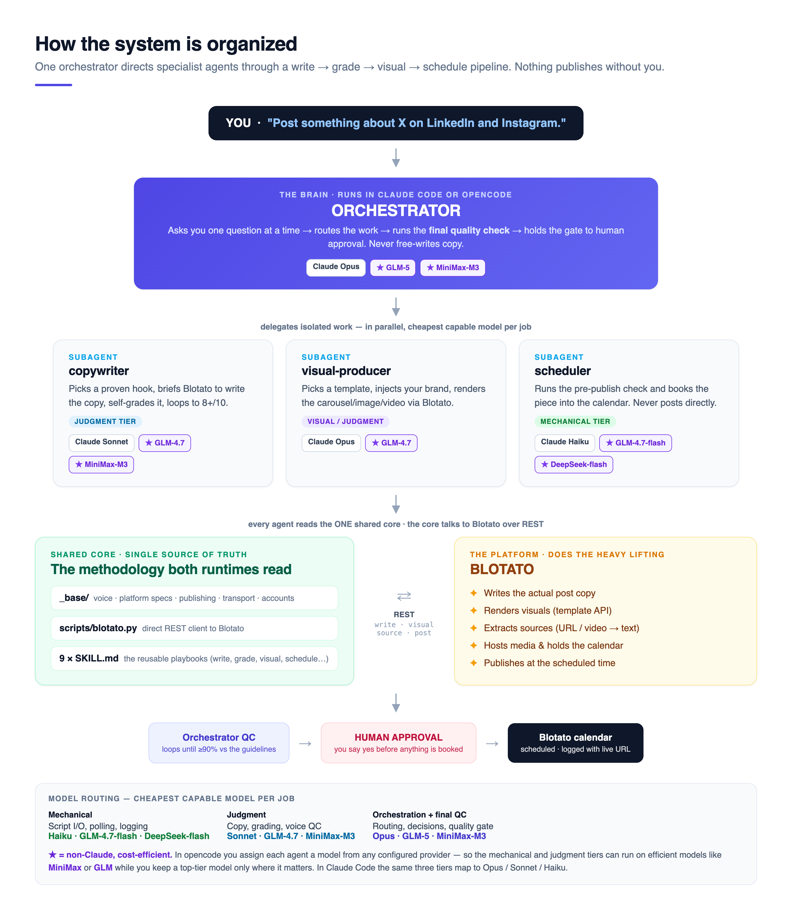
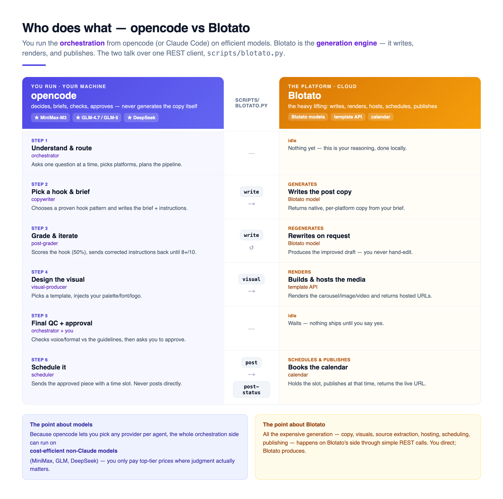

# Blotato Multi-Agent Kit

A **multi-agent social-media system** built on top of [Blotato](https://blotato.com)'s official
content pack. One **orchestrator** directs specialist **agents** — copywriter, visual-producer,
scheduler — through a **write → grade → visual → schedule** pipeline, with **human approval before
anything is scheduled**. It runs **identically in Claude Code and in opencode** over one shared
core, and it is **brand-agnostic**: clone it, fill in one brand, and go.

> **Two audiences, one doc.** The first half is plain-language — a product manager can read it and
> understand the whole system. The second half ("Under the hood") is for whoever sets it up.

---

# Part 1 · In plain words (for anyone)

## What is this, really?

Think of it as a **small content team made of AI agents**, with you as the editor-in-chief:

- A **manager** (the *orchestrator*) takes your request in plain language — *"post something about
  our new feature on LinkedIn and Instagram"* — and asks a couple of clarifying questions.
- It hands the work to **specialists**: a **copywriter** that writes and self-grades the post, a
  **visual-producer** that makes the image/carousel/video, and a **scheduler** that books it.
- The actual heavy lifting — writing the copy, rendering the visuals, hosting the media, holding
  the calendar — is done by **Blotato**, the platform. The agents *direct*; Blotato *produces*.
- **Nothing goes out without you.** Every piece stops for your approval and is only ever added to
  a calendar — never published on the spot.

## How it's organized



The manager delegates each isolable job to a specialist, and each specialist runs on the
**cheapest model that can do that job well** (more on this below). Everyone reads the same shared
"playbook" so the brand voice and rules stay consistent, and the platform (Blotato) does the
expensive generation through simple API calls.

## Who does what: you (opencode) vs Blotato



The short version: **you run the thinking, Blotato runs the making.** You orchestrate from
**opencode** (or Claude Code) — deciding, briefing, grading, checking, approving — while Blotato
writes the copy, renders the visuals, and publishes on schedule. The two sides talk over one small
REST client (`scripts/blotato.py`).

## Why the model choice matters (efficient, non-Claude models)

Not every step needs an expensive model. This kit sorts work into three tiers:

| Tier | What it's for | Good models |
|---|---|---|
| **Mechanical** | script calls, polling, logging | Claude Haiku · **GLM-4.7-flash** · **DeepSeek-flash** |
| **Judgment** | copywriting, grading, voice checks | Claude Sonnet · **GLM-4.7** · **MiniMax-M3** |
| **Orchestration + final QC** | routing, decisions, the quality gate | Claude Opus · **GLM-5** · **MiniMax-M3** |

The point: **in opencode you can run most of the pipeline on cost-efficient, non-Claude models
like [MiniMax](https://www.minimax.io) and [GLM (Z.ai)](https://z.ai)** — and only spend on a
top-tier model where judgment actually matters. That is the practical reason to run this in
opencode: it's a single system where you pick the best price/quality model for each agent. The
"how" is in [Part 2](#models--route-each-agent-to-the-most-efficient-model).

---

# Part 2 · Under the hood (for whoever sets it up)

## What it does

- **Native per-platform copy** — a topic comes out shaped for LinkedIn vs X vs Instagram, in your
  brand's voice, opened with a tested hook (the hook is graded as 50% of the score).
- **Visuals via the template API** — carousels, images, infographics, AI video, or a branded
  HTML→PNG carousel generator when the stock template isn't good enough.
- **Nothing publishes directly** — every piece goes to the Blotato **calendar** (`useNextFreeSlot`
  or a set time). The `post` command refuses to run without a scheduling flag.
- **Quality control by the orchestrator** — it verifies each returned piece against the repo's
  guidelines (voice, platform rules, hook, score) before it reaches you for approval.

## Repository structure

Every directory has one job. `_base/` + `scripts/` + the 9 `SKILL.md` files are the **shared
core** (one copy); `.claude/` and `.opencode/` are **thin adapters** that point at it.

```
blotato-multiagent-kit/
│
├── README.md              ← you are here
├── ANALYSIS.md            ← deeper writeup: what changed vs the pack + feedback for Blotato
├── CLAUDE.md              ← the orchestration guide the models actually follow (SINGLE SOURCE)
├── AGENTS.md              ← thin pointer to CLAUDE.md, for AGENTS.md-aware tools
├── opencode.json          ← opencode config: instructions + model routing + Blotato MCP (key via {env:})
├── .env.example           ← copy to .env at the ROOT, paste your Blotato API key
│
├── _base/                 SHARED CORE · runtime-agnostic methodology, loaded before every generation
│   ├── voice.md           ·   universal voice rules (no em dashes, anti-"AI slop", etc.)
│   ├── platform-specs.md  ·   per-platform limits, CTA rules, posting cadence
│   ├── linkedin-craft.md  ·   LinkedIn-specific format / rhythm / storytelling
│   ├── templates.md       ·   catalog of Blotato visual templates
│   ├── publishing.md      ·   Blotato REST mechanics + how Blotato writes the copy
│   ├── transport.md       ·   when to use REST vs MCP vs browser
│   ├── hooks.md           ·   pointer into the viral-hooks library
│   └── accounts.md        ·   TEMPLATE — your account/page IDs (placeholders to fill in)
│
├── scripts/               THE REST BRIDGE to Blotato
│   ├── blotato.py         ·   one CLI: write · source · visual · post · post-status · slots · accounts
│   └── carousel/          ·   HTML→PNG branded-carousel generator (for when the stock template is too generic)
│       ├── brand-template.html   ·   editable carousel scaffold (swap palette/font/logo)
│       └── render.js             ·   Chrome-headless renderer (HTML → PNG slides)
│
├── brand-brief.md         ← FILL IN · your brand voice / audience / wedge (template)
├── branding.md            ← FILL IN · palette / font / logo for visuals (template)
├── POSTS-LOG.md           ·   append-only log of everything scheduled (with live URLs)
├── posts/                 ·   generated drafts + rendered assets land here
├── examples/              ·   human-approved pieces kept as reusable molds
│
├── .claude/               RUNTIME ADAPTER · Claude Code
│   ├── skills/            ·   the 9 SKILL.md — THE single copy of the playbooks:
│   │   ├── social-manager/      orchestrator / front door
│   │   ├── content-coach/       "I don't know what to post" → ideas
│   │   ├── brand-brief/         capture the brand's voice
│   │   ├── viral-hooks/         100 proven hook frameworks
│   │   ├── post-writer/         native per-platform copy
│   │   ├── post-grader/         score hook/virality, loop to 8+
│   │   ├── visual-producer/     carousel / image / video
│   │   ├── repurpose/           1 long source → many pieces
│   │   └── post-scheduler/      schedule to the Blotato calendar
│   └── agents/            ·   3 subagents WITH model: routing (copywriter / scheduler / visual-producer)
│
├── .opencode/             RUNTIME ADAPTER · opencode
│   └── agents/            ·   the same 3 subagents (mode: subagent; model inherited from opencode.json)
│                          ·   opencode discovers the skills NATIVELY from .claude/skills/ — no plugin, no symlink
│
└── docs/                  the diagrams above
    ├── architecture.png
    ├── opencode-vs-blotato.png
    └── diagrams/          ·   editable HTML source + render.js (regenerate the PNGs)
```

**Single source, two runtimes.** The 9 skills live only in `.claude/skills/`. Claude Code reads
them there; opencode discovers them there natively (verify with `opencode debug skill`). Editing a
`_base/*.md` or a `SKILL.md` changes behavior in **both** runtimes — there is no second file to
touch.

## Setup

```bash
cp .env.example .env                      # at the project ROOT — then paste your Blotato API key
# BLOTATO_API_KEY=blt_...  (from my.blotato.com → Settings → API)
python3 scripts/blotato.py whoami         # validates the key
```

Fill in your brand: `brand-brief.md` (voice/audience/wedge), `branding.md` (palette/font/logo),
and `_base/accounts.md` (run `python3 scripts/blotato.py accounts` to get your real account IDs).

## Run it in Claude Code

- Open the repo in Claude Code. `CLAUDE.md` loads automatically; the 9 skills live in
  `.claude/skills/`, the 3 subagents in `.claude/agents/`.
- Say: *"Post something about &lt;topic&gt; on LinkedIn."* `social-manager` takes it from there.
- Model tiers map to **Opus** (orchestration + final QC), **Sonnet** (copy/grading), **Haiku**
  (mechanical).

## Run it in opencode

- opencode discovers the **same** skills natively from `.claude/skills/` (verify with
  `opencode debug skill`) and reads the 3 adapters in `.opencode/agents/`.
- `opencode.json` sets `"instructions": ["CLAUDE.md"]` and pulls the Blotato key from the
  environment via `{env:BLOTATO_API_KEY}`. opencode does **not** auto-load `.env`, so export it
  first (the Python side reads the root `.env` on its own):
  ```bash
  set -a; source .env; set +a
  opencode
  ```

### Models — route each agent to the most efficient model

This is the reason to run in opencode: **each agent's model is a config choice, and it can be any
provider you've authenticated** — not just Claude. Add an `agent` block to `opencode.json`:

```jsonc
// opencode.json — comments illustrative; use strict JSON (or an .jsonc) in the real file
{
  "$schema": "https://opencode.ai/config.json",
  "instructions": ["CLAUDE.md"],

  "model": "openrouter/z-ai/glm-5",                       // orchestrator + final QC (top tier)
  "agent": {
    "copywriter":      { "model": "openrouter/z-ai/glm-4.7" },      // judgment
    "visual-producer": { "model": "openrouter/z-ai/glm-4.7" },      // judgment / visual
    "scheduler":       { "model": "openrouter/z-ai/glm-4.7-flash" } // mechanical
  },

  "mcp": {
    "blotato": {
      "type": "remote",
      "url": "https://mcp.blotato.com/mcp",
      "headers": { "blotato-api-key": "{env:BLOTATO_API_KEY}" }
    }
  }
}
```

Real model IDs available in opencode (via the `minimax` and `openrouter` providers):

| Provider | Example IDs |
|---|---|
| **MiniMax** | `minimax/MiniMax-M3` |
| **GLM (Z.ai)** | `openrouter/z-ai/glm-5` · `openrouter/z-ai/glm-4.7` · `openrouter/z-ai/glm-4.7-flash` |
| **DeepSeek** | `deepseek/deepseek-v4-pro` · `deepseek/deepseek-v4-flash` |
| **Kimi (Moonshot)** | `openrouter/moonshotai/kimi-k2.7-code` |

Notes:
- Authenticate the provider once with `opencode auth login` (adds the API key for MiniMax /
  OpenRouter / etc.). List everything available with `opencode models`.
- The shipped `opencode.json` is intentionally **model-agnostic** (agents inherit the top-level
  `model`) so the repo clones and runs anywhere. Add the `agent` block above to opt into per-agent
  routing. You can also set `model:` in an agent's frontmatter instead — same effect.
- Mix freely: a common setup is a strong model for the orchestrator's final QC and efficient
  non-Claude models (GLM / MiniMax) for the copywriter, visual-producer, and scheduler.

## The pipeline, step by step

1. **post-writer** (copywriter) — picks a hook pattern (`viral-hooks`), briefs Blotato, which
   writes the copy; **post-grader** scores it (hook = 50%) and loops to ≥8, regenerating via
   Blotato with corrected instructions. Never hand-edited.
2. **visual-producer** — picks a template, injects your branding, renders via Blotato (or the
   HTML→PNG carousel generator), saves the bytes into `posts/assets/`.
3. **Orchestrator QC** — the orchestrator checks the piece against `_base/` + your brand files;
   loops until ≥90% agreement, then hands it to you.
4. **Human approval** → **post-scheduler** schedules it to the calendar and logs the row (with the
   live URL backfilled) in `POSTS-LOG.md`.

## What we changed vs. the official pack

| Area | Official pack | This kit |
|---|---|---|
| Transport | MCP-only | **Direct REST** (`scripts/blotato.py`); MCP optional fallback |
| Agents | Single-assistant skills | **Multi-agent orchestration** + explicit **model routing** across providers |
| Models | Claude | **Any provider per agent** — efficient non-Claude (MiniMax / GLM / DeepSeek) for most tiers |
| Visuals | No visuals skill | **`visual-producer`** — visuals via the template API + branded HTML→PNG carousels |
| Runtime | Claude-only | **Portable** — same core runs in Claude Code **and** opencode via thin adapters |

Details and product feedback in [`ANALYSIS.md`](ANALYSIS.md).

## Credit

Built on **Blotato's official content pack** (the 7-skill base: content-coach, brand-brief,
viral-hooks, post-writer, post-grader, repurpose, post-scheduler). Blotato does the heavy lifting —
copy generation, visuals, source extraction, and the calendar — through its API.
→ **[blotato.com](https://blotato.com)**

---

> **A note on language.** This README and `ANALYSIS.md` are in English. The internal orchestration
> guides (`CLAUDE.md`, the `SKILL.md` files, `_base/`) are in Spanish — the author's working
> language, model-facing not user-facing. Generated **post copy** comes out in whatever language
> you set in `brand-brief.md`. No secrets are committed: the root `.env` is gitignored,
> `opencode.json` uses `{env:BLOTATO_API_KEY}`, and the only placeholder is in `.env.example`.
